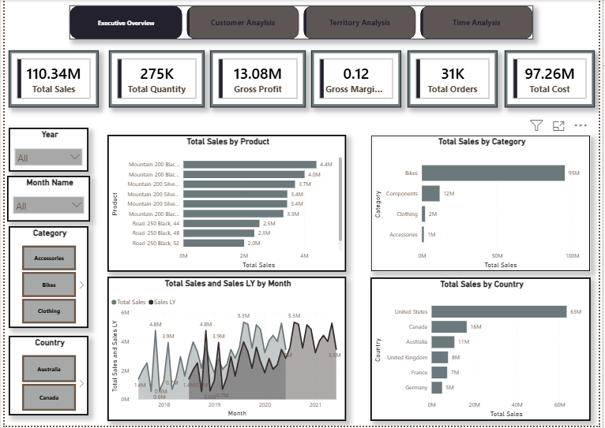
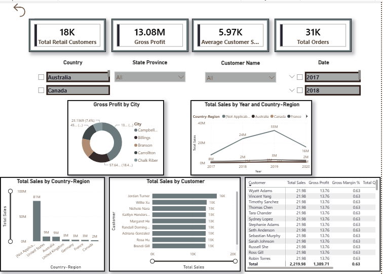
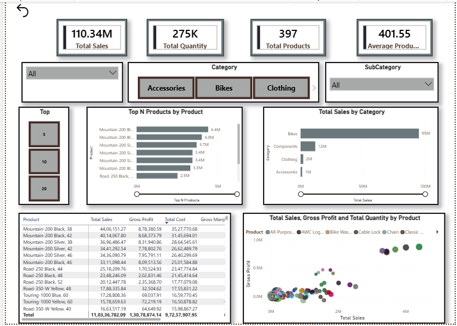
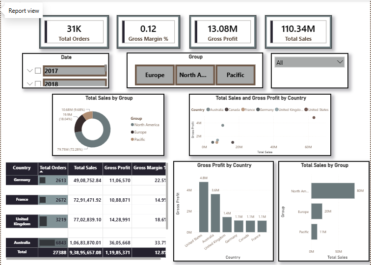
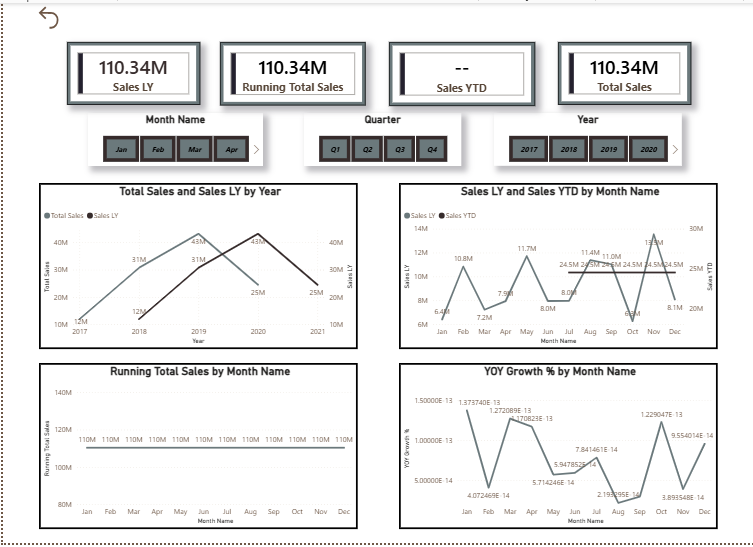

# Adventure Works Sales & Profitability Dashboard

## Project Title

**Adventure Works Sales & Profitability Dashboard** — a 5-page Power BI report analyzing sales, profitability, customers, products, territory, and time-based performance for Adventure Works.

## Business Objective

Build a centralized Power BI dashboard that provides a single source of truth for revenue, profitability, customer and channel performance, product performance, and geographic trends.

The project is designed to support business stakeholders such as sales leadership, product management, and territory managers in understanding performance and making data-driven decisions.

## Business Questions Answered

- How much are we selling, and how is sales performance trending over time?
- How profitable are we at the gross-margin level?
- Which products and categories drive revenue and profit?
- Which customers are most valuable, and how concentrated is customer value?
- Which geographic markets generate the most revenue and profit?
- How does the current period compare with the previous year?
- What are the current YTD and running-total sales positions?
- Which products and customers contribute most to overall performance?

## Dashboard Preview











## Dataset Description

Source: `AdventureWorks Sales.xlsx`

The dataset contains 7 tables:

| Table | Rows | Grain |
|---|---:|---|
| Sales | 121,253 | One row per sales order line |
| Sales Order | 121,253 | Bridge between order lines and order numbers |
| Product | 397 | One row per product (SKU) |
| Customer | 18,484 | One row per retail/Internet customer |
| Reseller | 702 | One row per reseller partner |
| Sales Territory | 11 | One row per territory |
| Date | 1,461 | One row per calendar day |

The `Sales` table contains **121,253 sales order lines**, while the dataset contains **31,455 distinct sales orders**.

Two sales channels are represented in the fact table:

- **Internet** — direct-to-consumer transactions associated with retail customers.
- **Reseller** — B2B transactions associated with reseller partners.

The dataset uses intentional `-1` sentinel values for the non-applicable customer/reseller key depending on the sales channel.

## Data Model

The project uses a **star-schema design** with `Sales` as the central fact table.

Dimension tables include:

- `Product`
- `Customer`
- `Reseller`
- `Sales Territory`
- `Date`

A dedicated `Sales Order` table is used to resolve the difference between the **sales-line grain** and the **order grain**, allowing Total Orders to be calculated using the actual business order number.

The model was reviewed and validated to ensure that KPI calculations respect the intended business grain and filtering behavior.

## Data Preparation & Validation

The source data was validated for:

- Referential integrity
- Duplicate keys
- Missing values
- Sales-line grain
- Order-level grain
- Customer/reseller channel behavior
- Revenue field consistency

No orphaned keys were identified across the main dimension relationships.

A discrepancy was identified between `Extended Amount` and `Sales Amount`. After reconciliation against `Unit Price × Order Quantity`, `Extended Amount` was selected as the primary auditable revenue field.

The final revenue calculation therefore uses:

**Extended Amount = Unit Price × Order Quantity**

with the known source-data variance documented during the validation process.

## Power Query

Power Query was used as part of the data preparation workflow to structure and prepare the source data for the Power BI model.

The final report uses a validated dataset and a structured star-schema model to support consistent reporting and DAX calculations.

## DAX

The project contains **30+ DAX measures** covering:

- Base KPIs
- Revenue and cost
- Gross profitability
- Time intelligence
- Ranking
- Dynamic Top N analysis
- Product contribution
- Customer segmentation

During the project review and refinement process, the DAX logic and business definitions were validated and improved.

Key improvements included:

- Correcting **Total Orders** to count distinct business orders rather than sales lines.
- Correcting **Total Cost** to use line-level product cost rather than per-unit product standard cost.
- Rebuilding **Customer Segment** using a data-driven percentile approach instead of arbitrary fixed thresholds.
- Consolidating duplicate measure organization into a single measures layer.
- Standardizing revenue calculations on `Extended Amount`.
- Implementing Dynamic Top N product analysis.
- Applying time-intelligence measures for YTD, previous-year comparison, running totals, and YoY growth.

## Key KPIs

- Total Sales
- Total Orders
- Total Retail Customers
- Total Products
- Gross Profit
- Gross Margin %
- Average Order Value
- Average Selling Price
- YoY Growth %
- Sales YTD

## Dashboard Pages

### 1. Executive Overview

Provides the overall business picture through:

- Top-line KPIs
- Sales trends
- Category performance
- Country performance

### 2. Product Analysis

Analyzes:

- Category sales
- Product sales
- Gross profit
- Product contribution
- Product Sales vs Average
- Dynamic Top N Products

### 3. Customer Analysis

Analyzes:

- Customer sales
- Customer profitability
- Customer ranking
- Customer segmentation
- Customer value concentration

### 4. Territory Analysis

Analyzes:

- Geographic sales
- Gross profit
- Gross margin
- Country and territory performance

### 5. Time Analysis

Analyzes:

- Sales trends
- Sales LY
- Sales YTD
- Running Total Sales
- YoY Growth %

## Key Insights

### Revenue Growth

Revenue increased from approximately **$24.0M in FY2018** to **$52.2M in FY2020**, showing strong year-over-year growth.

### Product Concentration

**Bikes generate approximately 86.2% of total revenue**, making them the dominant revenue category and creating a significant concentration risk.

### Channel Mix

The **Reseller channel generates approximately 73.4% of revenue**, while the Internet channel contains substantially more individual retail customers.

This highlights the importance of reseller-partner performance to the overall business.

### Customer Concentration

The **top 20% of Internet customers generate approximately 66.4% of Internet-channel revenue**, demonstrating significant customer-value concentration.

### Geographic Performance

The **United States is the largest market**, generating approximately $63.3M in sales, followed by Canada, Australia, the United Kingdom, France, and Germany.

## Business Recommendations

### 1. Diversify Beyond Bikes

With Bikes representing approximately 86% of revenue, expanding the contribution of other product categories could reduce revenue concentration risk.

### 2. Monitor Reseller Productivity

Because reseller partners generate the majority of revenue, tracking revenue and profitability by reseller can help identify high-performing partners and opportunities for improvement.

### 3. Explore European Growth

European markets represent a meaningful but smaller share of total revenue compared with North America, providing potential opportunities for further market development.

## Tools

- **Power BI Desktop** — data modeling, DAX, visualization, dashboard development
- **Power Query** — data preparation and transformation
- **Excel** — source dataset
- **Python / pandas** — data validation and audit analysis

## Skills Demonstrated

- Star-schema data modeling
- Fact and dimension table design
- Bridge-table modeling for grain mismatches
- DAX measure development
- Time Intelligence
- Ranking and Top N analysis
- Dynamic Top N implementation
- Percentile-based customer segmentation
- Data quality auditing
- Business KPI definition and validation
- Dashboard and UX design
- Business insight generation
- Technical documentation

## Project Structure

```text
Adventure Works Sales & Profitability Dashboard/
│
├── Adventure Work.pbix
├── AdventureWorks Sales.xlsx
├── README.md
└── Insights.md
```

## How to Use the Dashboard

Open the `.pbix` file in **Power BI Desktop**.

Start with the **Executive Overview** page for the overall business picture, then use the navigation buttons to explore:

1. Product Analysis
2. Customer Analysis
3. Territory Analysis
4. Time Analysis

Use the available slicers to analyze performance by the relevant time periods, categories, countries, customers, and other dimensions.

The dashboard is designed to allow users to move from high-level KPIs to detailed product, customer, geographic, and time-based analysis.
